# Universal style transfervia feature transforms

This is a re-implementation of the paper "Universal style transfervia feature transforms" by Li et al.. 
The implementation follows most but not all details from the paper, including output activation, etc...

## Requirements

[Theano](http://deeplearning.net/software/theano/index.html)

[neuralnet](https://github.com/justanhduc/neuralnet)

[VGG pretrained weight file](https://github.com/ftokarev/tf-vgg-weights/raw/master/vgg19_weights_normalized.h5).
Put this in the root folder.

## Usages

Type help for more details. Basically there are two main functions as follows.

### Training
#### Preparation

Download the MS COCO 2017 train and valid sets [here](http://cocodataset.org/#download). 
Next download the [Wikiart](https://www.kaggle.com/c/painter-by-numbers) train/test dataset.

#### Training
To train a network using the default settings, use

```
python train.py path-to-MS-COCO-train path-to-Wikiart-train path-to-MS-COCO-val path-to-Wikiart-test
``` 

### Testing
First, download the above VGG weight file. To test whether for a single image or folder of images, simply use

```
python test.py path-to-input path-to-style path_to_weight_files
```

```path_to_weight_files``` must contain 5 weight files with signature ```decoder-X-final.npz``` where ```X= [1, 4, 7, 12, 17]```.

A model trained by this implementation can be downloaded [here](https://s3.ap-northeast-2.amazonaws.com/pretrained-theano-models/wct.zip). 

## Examples
<p align='center'>
  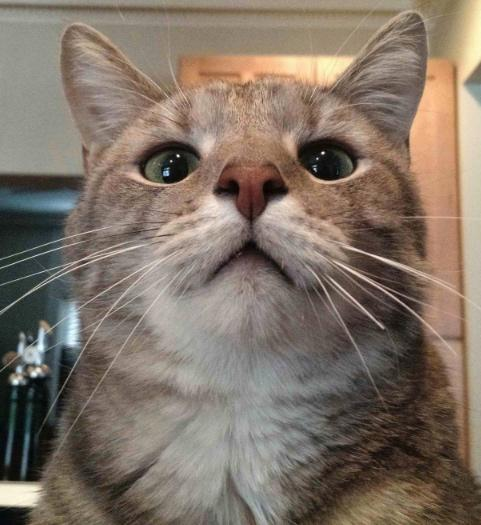
  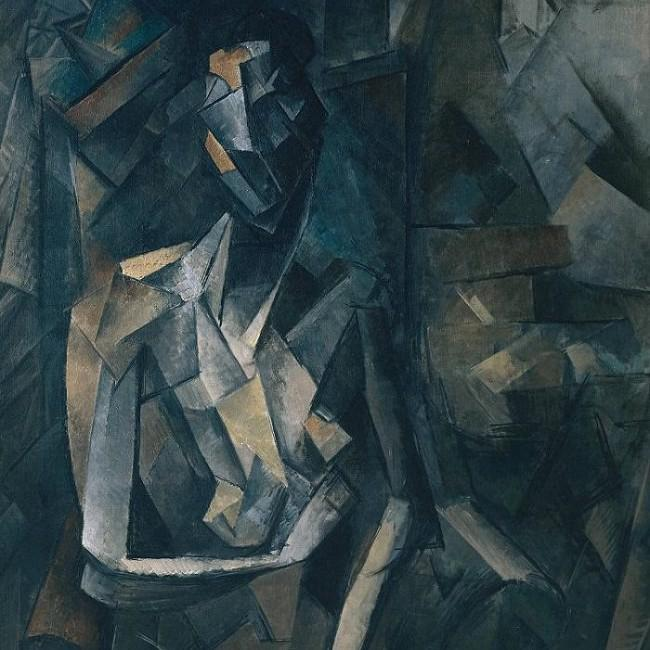
  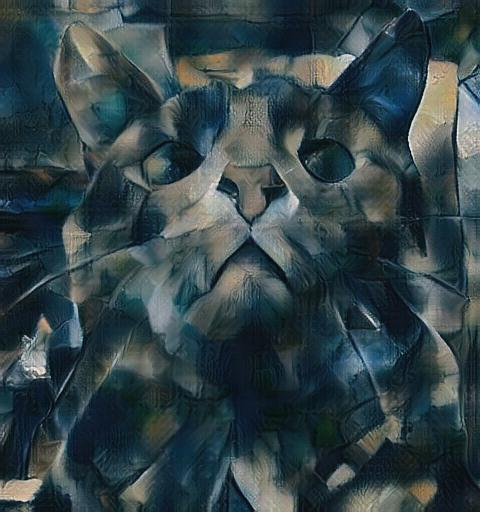
  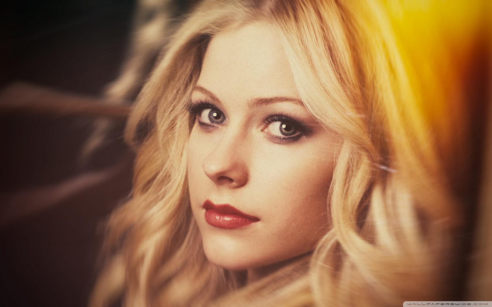
  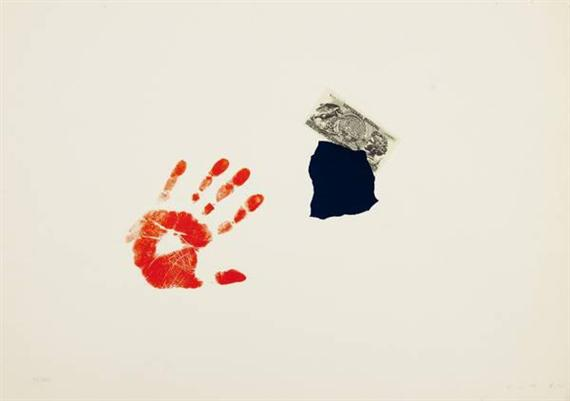
  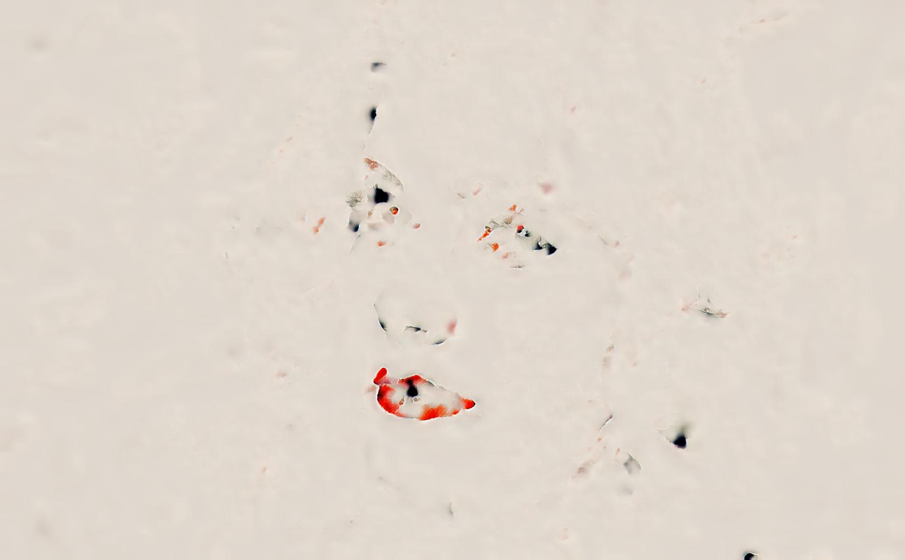
</p>

<p align='center'>
  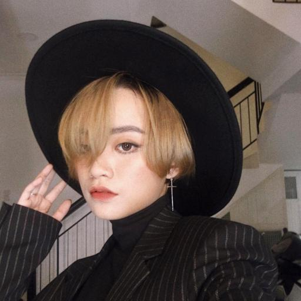
  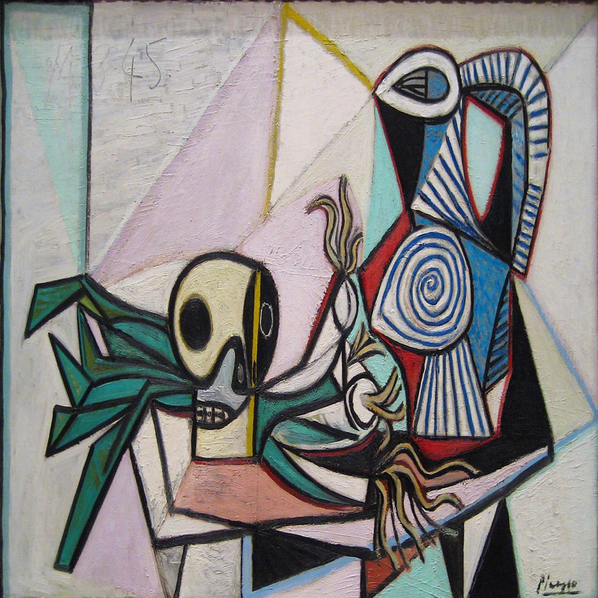
  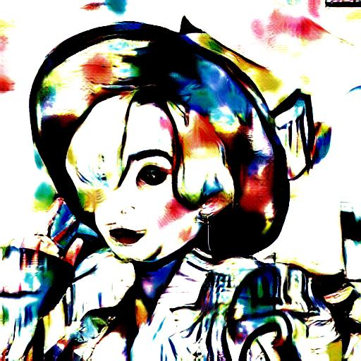
  
  
  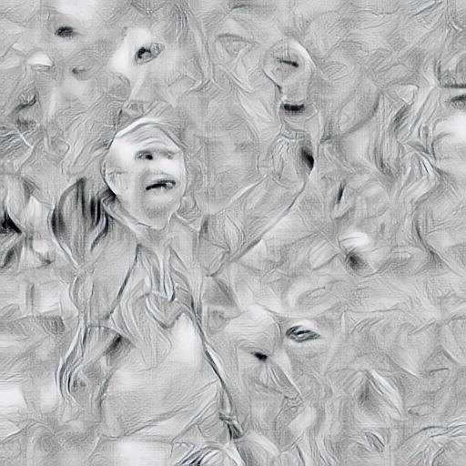
</p>

<p align='center'>
  
  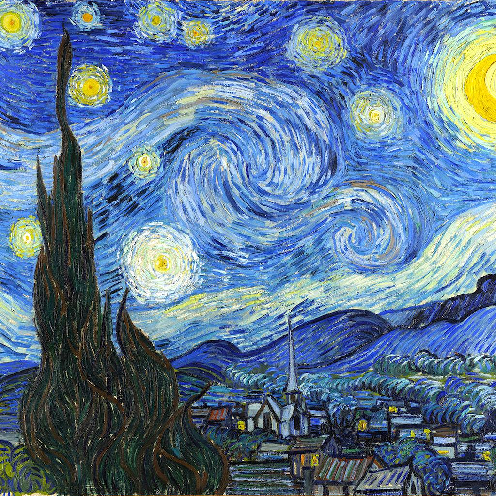
  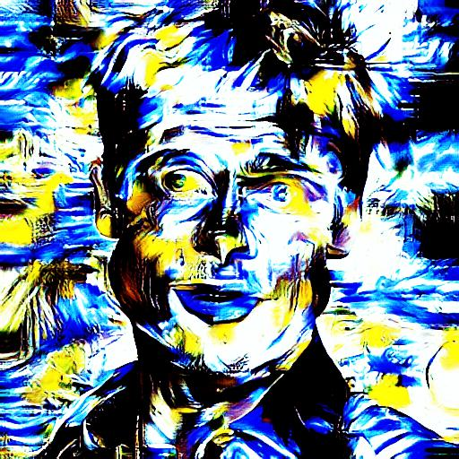
  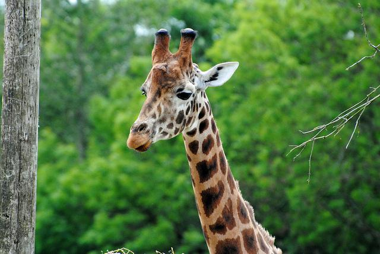
  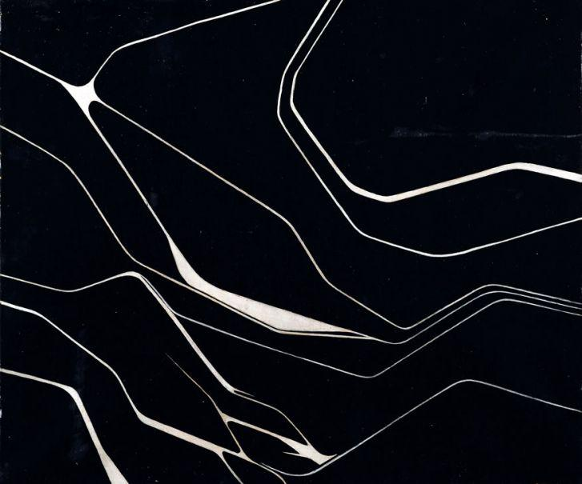
  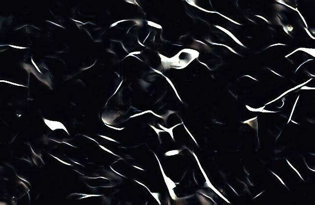
</p>

## References
"Universal style transfervia feature transforms" by Li et al..

The pretrained VGG is taken from [this Tensorflow implementation](https://github.com/ftokarev/tf-adain).

